# Anvaya_CRM

Anvaya_CRM Frontend is a modern and responsive Customer Relationship Management (CRM) web application built to streamline lead management, sales tracking, and business operations. The project focuses on delivering a smooth user experience with efficient state management, dynamic data visualization, advanced filtering, and scalable frontend architecture.

Built using modern frontend technologies, the project follows component-based architecture and clean coding practices to ensure scalability and easy maintenance. The frontend communicates seamlessly with backend APIs while handling loading states, request cancellation, retries, and error management efficiently.

## Demo Link

Deployed project **[Live Demo](https://anvaya-crm-frontend-phi.vercel.app/)**

## Frontend Setup

```
git clone https://github.com/Ak4Das/Anvaya_CRM_Frontend.git
cd Anvaya_CRM_Frontend
npm install
touch .env
put 'VITE_MODE = DEVELOPMENT' in your .env file
npm run dev
```

## Backend Setup

```
git clone https://github.com/Ak4Das/Anvaya_CRM_Backend.git
cd Anvaya_CRM_Backend
npm install
touch .env
put 'MONGODB = <your mongodbUri>' in your .env file
node index.js
```

## Tech Stack

#### These are the main technologies used to build the application:

#### _Frontend_

- **JavaScript (ES6+)**
- **React.js**
- **HTML5**
- **CSS3**
- **Bootstrap**

#### _Backend_

- **Node.js**
- **Express.js**

#### _Database_

- **MongoDB**

## Libraries & Tools

#### These help implement specific features:

- **React Router** (_routing_)
- **Axios** (_HTTP client_)
- **Formik** (_form management_)
- **Yup** (_schema validation_)
- **Chart.js** (_data visualization_)
- **React Select** (_enhanced select component_)
- **React Toastify** (_notifications_)
- **React Big Calendar** (_calendar_)
- **Bootstrap Icons** (_Icons_)

## Demo Video

Watch a walkthrough (15 - 16 minutes) of all major features of this app:
**[Loom Video Link](https://drive.google.com/file/d/13A2BE_-xJ2myhMIUxeEZcxzPH7d1Gz1g/view?usp=sharing)**

## Key Features

- Responsive and modern UI (Responsive till **350px**)
- Manage agents, leads, and sales data
- Reports in different time frame like previous 1 month, 6 month and 1 year
- Dynamic charts and analytics dashboard
- Advanced filtering and sorting
- Form validation and error handling
- Optimized API requests with AbortController
- Retry mechanisms for failed requests
- SPA routing support
- Scalable and maintainable architecture

## Detailed Features

The application includes features such as lead management, sales analytics, chart-based insights, form validation, filtering & sorting, asynchronous data handling, and optimized API communication. It is designed with performance, maintainability, and user experience in mind.

**Dashboard**

- Displays the number of leads in the pipeline grouped by status.
- Displays overall agent performance through charts and tabular reports.
  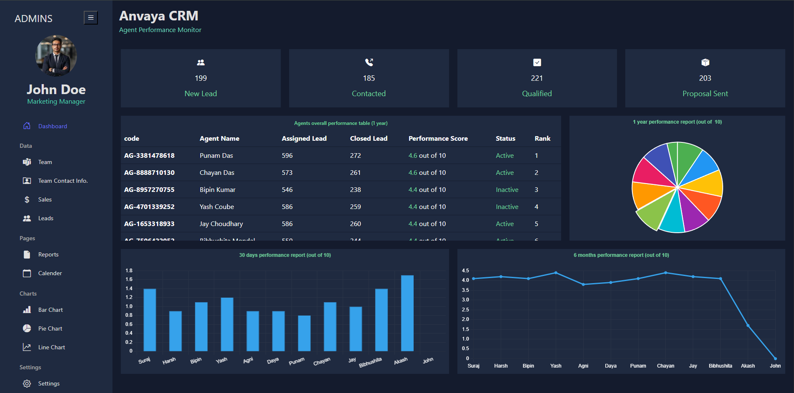

**Team Page**

- Displays list of all team members with their details in table format
- You can sort data in ascending and descending order and filter using search by category
- This page contains Add New Agent btn
  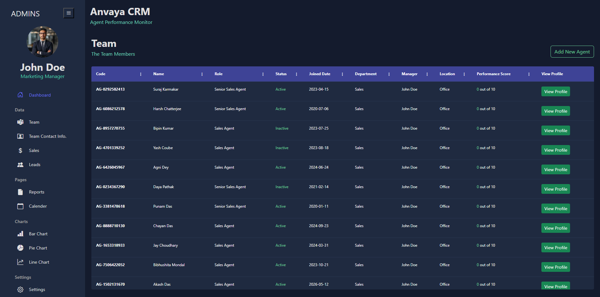

**Team Contact Info Page**

- Displays contact info of team members in table format
- You can sort data in ascending and descending order and filter using search by category
  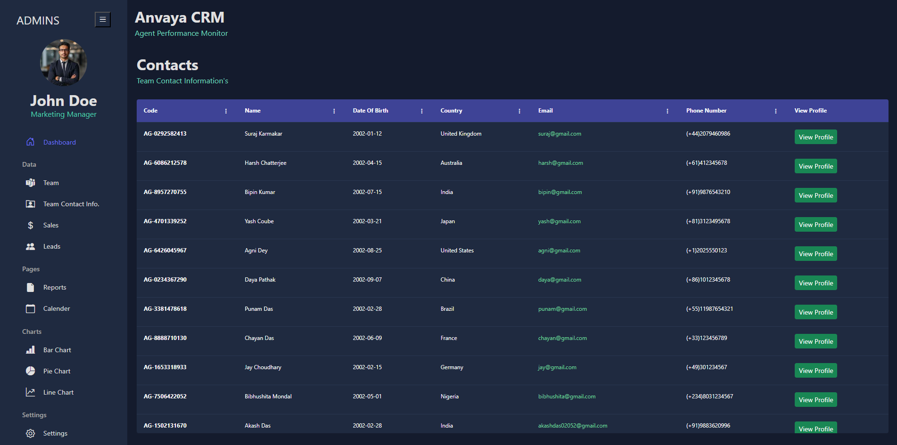

**Sales Page**

- Displays sales data with agent id, email, name in table format
- You can sort data in ascending and descending order and filter using search by category
  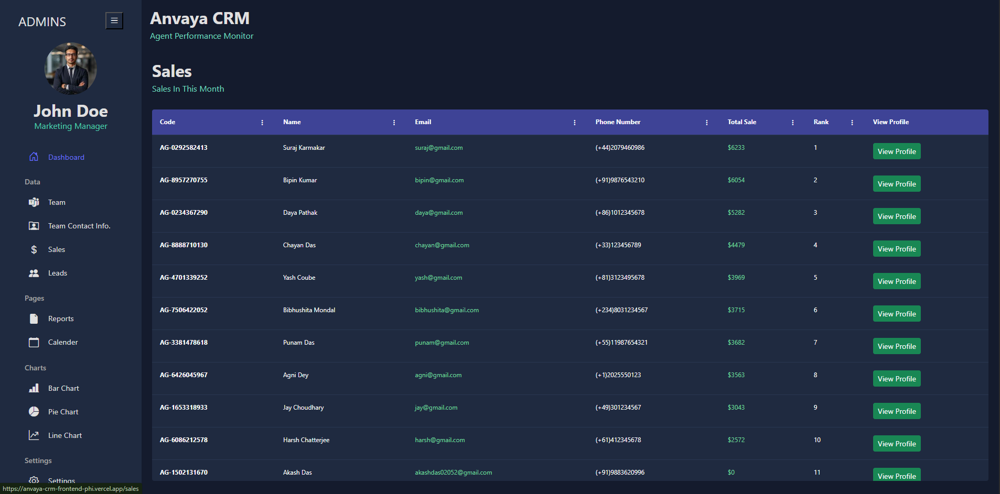

**Lead Page**

- Displays a list of all leads currently in the pipeline with necessary details in table format
- You can sort data in ascending and descending order and filter using search by category
- This page contains Add New lead btn
  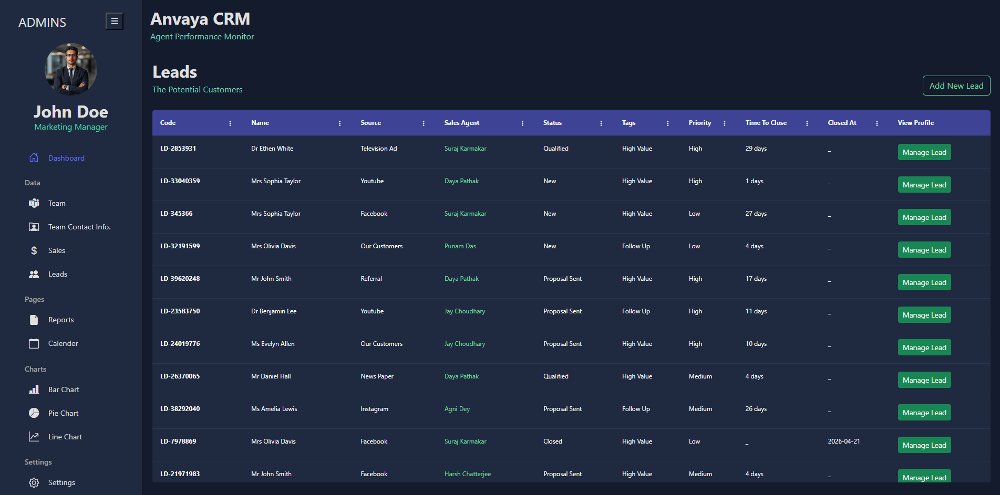

**Sales Agent Page**

- Displays a particular agent related data
- Contains leads data handled by the agent in table format
- You can sort data in ascending and descending order and filter using search by category
- It contains Edit Agent btn
  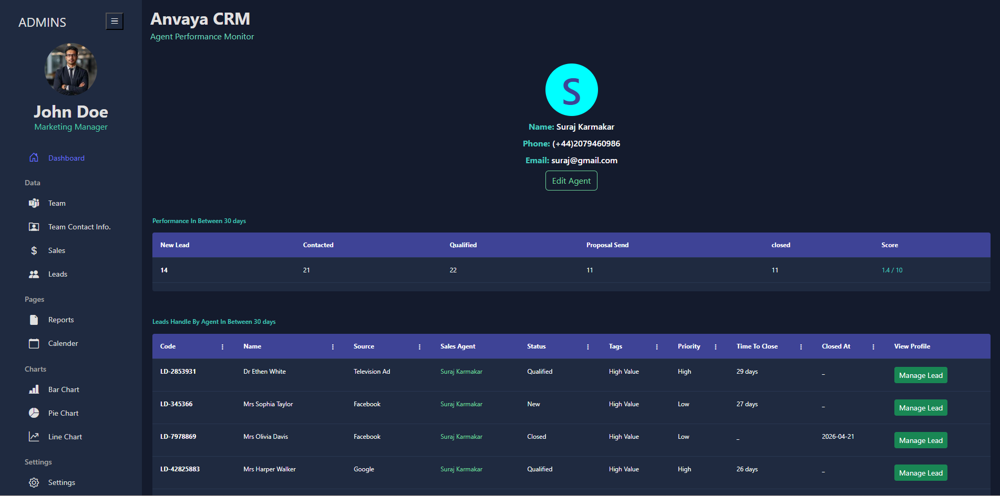
  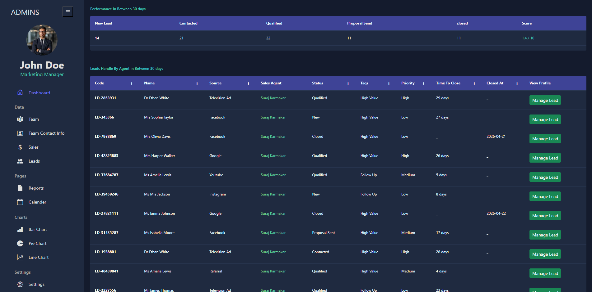

**Manage lead Page**

- Displays a particular lead related data
- Contains comment section with two subsection previous comment section and add comment section
- You can add new comment here and see the previous comments also
- It contains Edit Lead Details btn
  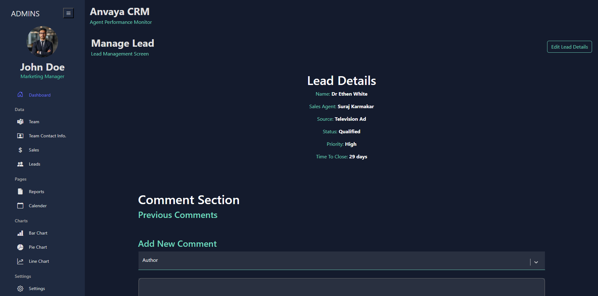
  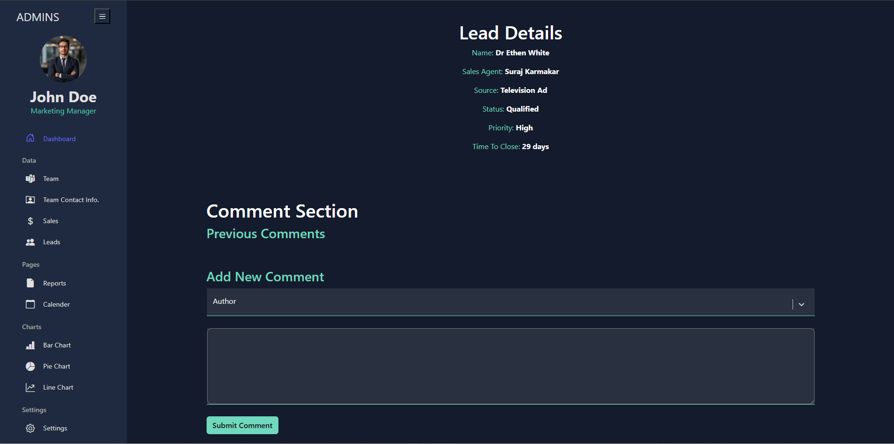

**Add New Agent Form**

- Here you can add new agent
- Form is handled by formik and validate by yup
  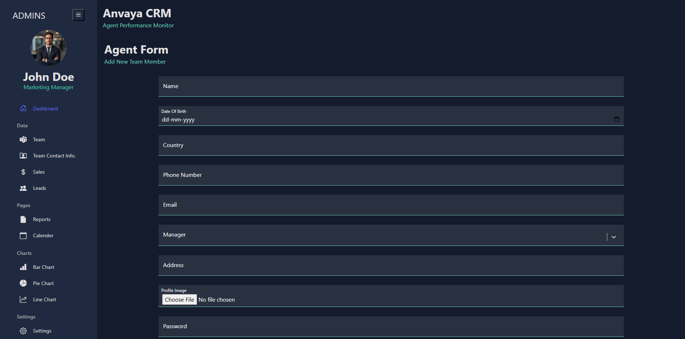

**Add New Lead Form**

- Here you can create new lead
- Form is handled by formik and validate by yup
  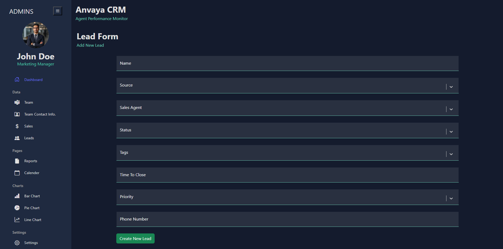

**Edit Lead Form**

- Here you can edit existing lead
- Form is handled by formik and validate by yup
  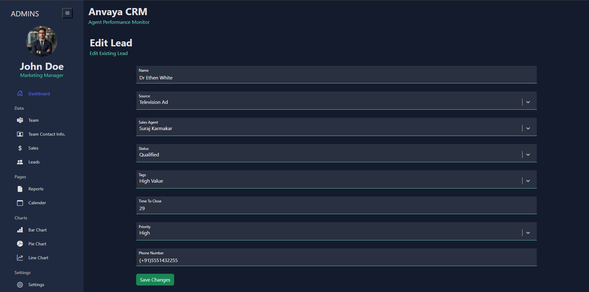

**Edit Agent Form**

- Here you can edit existing agent
- Form is handled by formik and validate by yup
  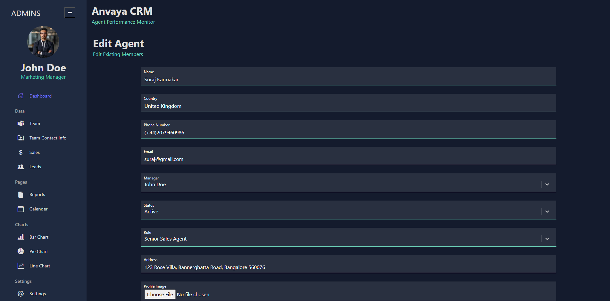

**Reports Page**

- Displays reports of the agents and leads
- From dropdown you can select time frame to see reports in the selected time frame
  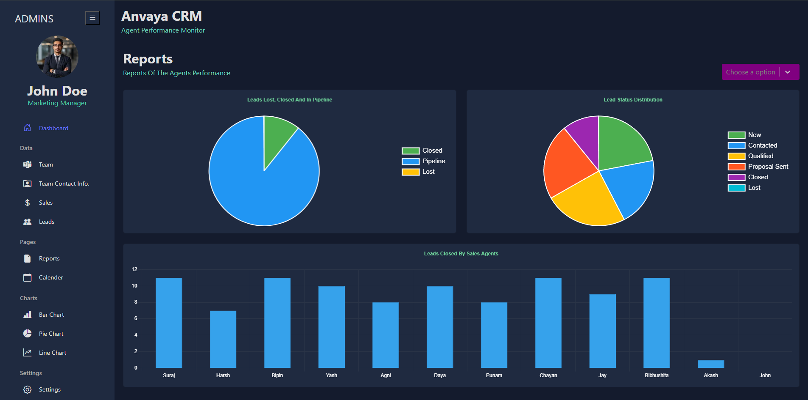

**Settings Page**

- From this page you can delete a particular agent
- This page displays list of all team members with their details in table format
- You can sort data in ascending and descending order and filter using search by category
  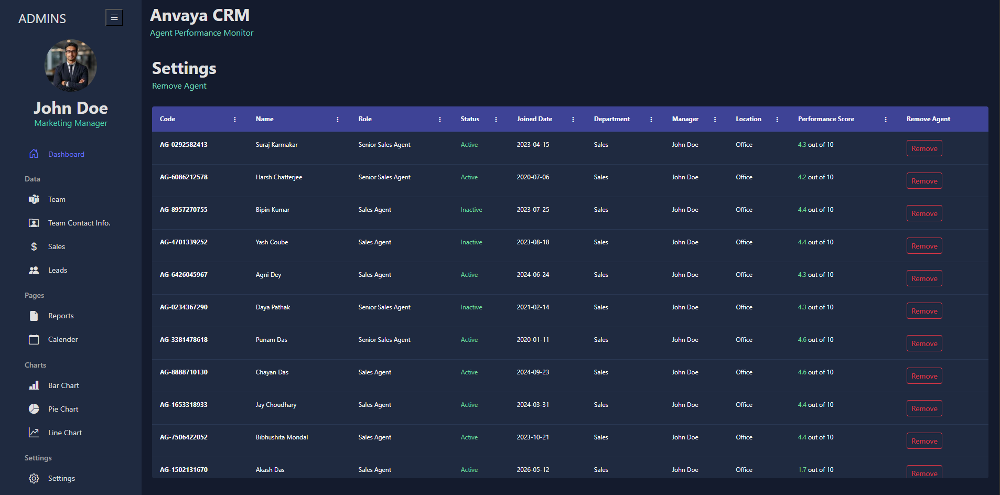

**Calendar Page**

- This page displays calendar to show past, present and future events and add event button
  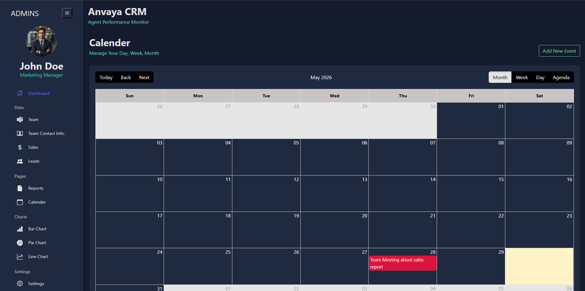

**Add Event Page**

- This page contains add event form
  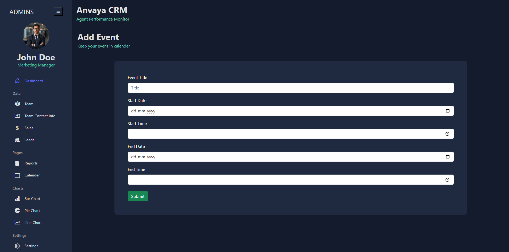

**Request Optimization**

- Optimize request with AbortController
- Retry mechanisms for failed requests

**Error Handling**

- Error handling using state

**Code Structure**

- Clean, Scalable, maintainable and easy to understand code structure

**Responsiveness**

- App is responsive till **350px**
- **Tab view**
  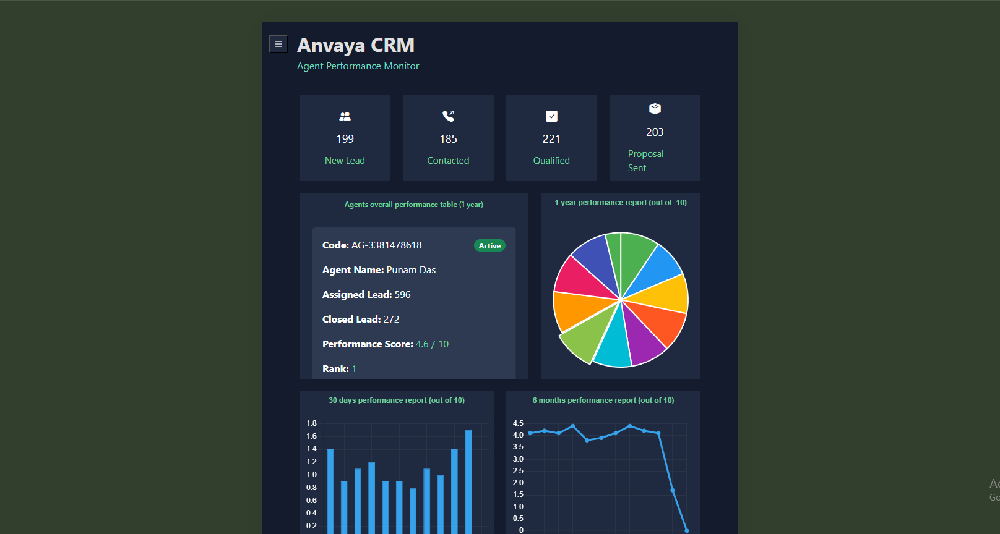
- **Mobile view**
  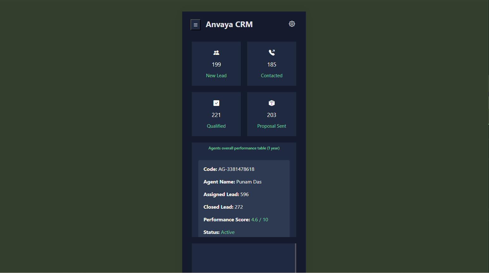

## Architecture Highlights

- Component-based React architecture
- Modular API service layer
- Centralized error handling
- Feature-based folder structure
- Component based Style Modules
- Reusable functions
- Reusable charts
- Reusable custom styles
- Reusable request to server functions

## Engineering Highlights

- **Request cancellation** using AbortController
- **Retry mechanism** for failed requests
- **Optimized API handling** for slow servers
- Prevention of unnecessary **request stacking**
- **Improved user experience** during loading/error states
- **Dynamic report** generation
- Reusable chart components
- Responsive design down to **350px**
- **Form validation** using Formik and Yup

## API Reference

#### **GET /agents** (List all agents)

Sample Response:

```javascript
{
    success: true,
    message: "Agents fetched successfully",
    respondedData: [{ _id, agentCode, name, ... },...],
}
```

#### **GET /leads?minDay=0&maxDay=30** (Get all leads created in between 30 days)

Sample Response:

```javascript
{
    success: true,
    message: "Leads fetched successfully",
    respondedData: [{ _id, leadCode, name, status, ... },...],
}
```

#### **POST /agents/addAgent** (Create a new agent)

Sample Response:

```javascript
{
    success: true,
    message: "Agent Created successfully",
    respondedData: { agentCode, name, dateOfBirth, country, ... },
}
```

#### **PATCH /leads/update/:id** (Update lead by id)

Sample Response:

```javascript
{
    success: true,
    message: "Lead updated successfully",
    respondedData: { _id, leadCode, name, status, ... },
}
```

## Goal of the Project

The goal of this project is to build a production-ready CRM frontend that demonstrates modern frontend engineering practices, efficient API handling, clean UI/UX, and scalable application structure suitable for real-world business applications.

## Contact

For bugs or feature requests, please reach out to **akashdas02052@gmail.com**
